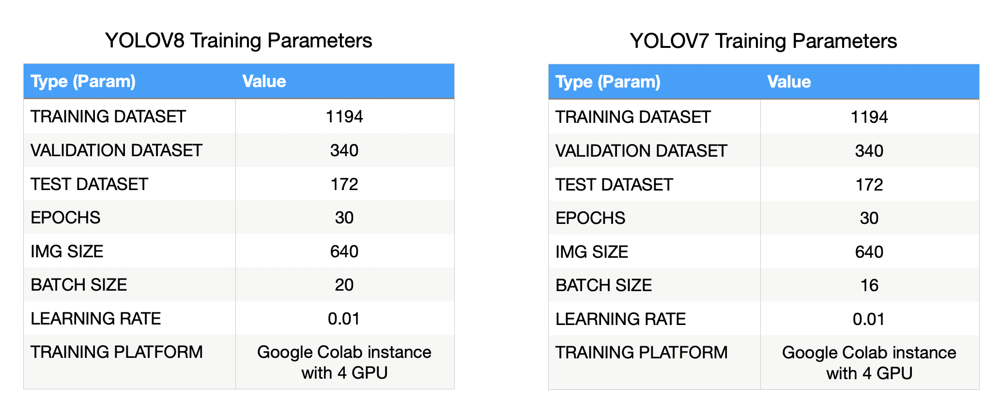
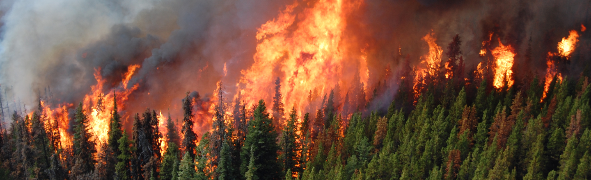
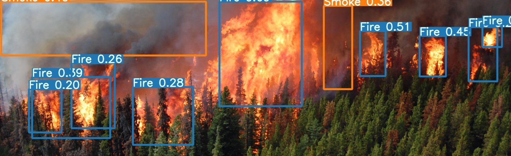

# Forest Fire & Smoke Detection using YOLOv8 & YOLOv7
### a demo project in the context of the course "Machine Learning and Content Analytics" of the MSc in Business Analytics at Athens University of Economics and Business (AUEB)
#### ~ <a href="https://forestfiresmokedetection.streamlit.app/" target="_blank">Streamlit App</a>
This project serves as a demonstration of the capabilities of two pre-trained models for inference tasks—YOLOv8 and YOLOv7. Both models have been trained using identical parameters, including the dataset, computational resources, number of epochs, and other characteristics. The models are integrated within a serverless <b>Streamlit</b> application for seamless user interaction.<br>
The dataset used for training is the [Fire Image Dataset V2](https://universe.roboflow.com/kirzone/fire-iejes/dataset/2#) from [Roboflow](https://universe.roboflow.com/) (on open source website) and the models were trained on a Google Colab instance with a T4 GPU.<br><br>
<b>Model Training Params:</b>
<br>

## Google Colab Notebooks used for training:
- [YOLOv8](https://colab.research.google.com/drive/1oOhKRR0QGHGdBYt3ru9HHZj8VXdTlAv3) (Link To Be Replaced)
- [YOLOv7](https://colab.research.google.com/drive/1lWRhfprK58WxoUX5I38y3GW6-1rCWfzp#scrollTo=GD9gUQpaBxNa)

## Instructions & Inference besides Streamlit App:
- Clone the repo
- Install the requirements.txt file by running the following command:
    ```
    pip install -r requirements.txt
    ```
- Open "predict_from_model.ipynb" file and run the cells given the path to the image you want to predict
- The predictions will be saved in the "runs" folder

## YOLOv8 Preview:
#### Original Video:
<br>

#### Inference Video:
<br>

## YOLOv7 Preview:
| Original Image                            | Inference Image                           |
| ----------------------------------- | ----------------------------------- |
|  |  |

## Creds:
- [YOLOv8 Official](https://ultralytics.com/yolov8) (The model used for training was yolov8m.pt - Medium Sized Model Version)
- [YOLOv7 Official](https://github.com/WongKinYiu/yolov7) (The model used for training was yolov7_training.pt - Transfer Learning Version)
- [YOLOv7 with Python API instead of CLI](https://github.com/kadirnar/yolov7-pip)
 