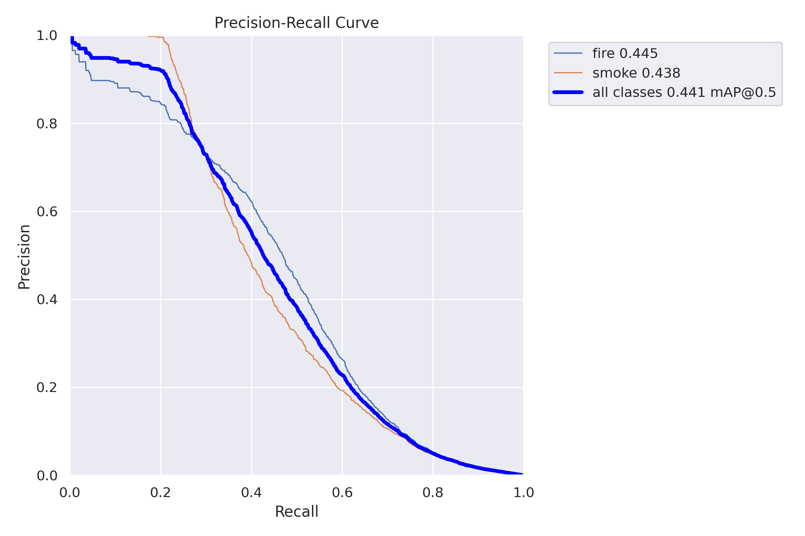
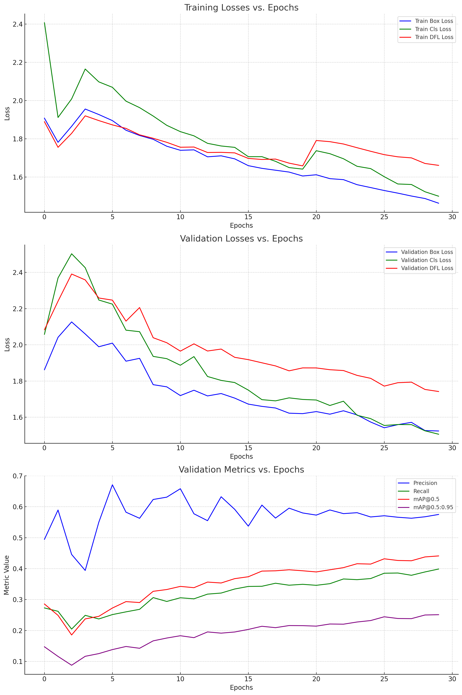

# Model Analysis

# 1. Precision - Recall Curve
The precision-recall curve shows the tradeoff between precision and recall for different threshold. A high area under the curve represents both high recall and high precision, where high precision relates to a low false positive rate, and high recall relates to a low false negative rate. High scores for both show that the classifier is returning accurate results (high precision), as well as returning a majority of all positive results (high recall). 

#### Graph 1.1: Precision-Recall Curve
 

`In our case:`
* *`High Precision at Low Recall`*: At the beginning of the curve (towards the left), the precision is very high, suggesting that the model is highly confident in its positive predictions for a limited set of instances. However, as we try to capture more positive instances (increasing recall), the precision starts to drop, indicating that the model begins to make more false positive errors.  
* *`Curve Shape`*: The curve is relatively smooth but has some dips, suggesting that there are certain thresholds where the precision drops more significantly. This could be due to various reasons like class imbalance or certain classes being harder to predict than others.
* *`Area Under the Curve (AUC)`*: A larger area under the PR curve indicates better performance. From the graph 1.1 above, the curve seems to cover a good portion of the graph, indicating decent performance. 
* *`Curve's Decline`*: Towards the extreme right of the graph, there's a steeper decline. This indicates that as we try to achieve <b>very high recall, the precision drops off more rapidly</b>. This could be due to the model struggling with more challenging or ambiguous instances as said in bibliography. In our case, since smoke and fire are quite ambiguous, in both shape and color, it is expected that the model will struggle to predict them with high confidence. 

# 2. Training Statistics
#### Graph 2.1: Training Statistics
 

Based on the Graph 2.1 above (derived from the file [results.csv](results.csv) that has occured during the training process of the model), we can infer the following:

`Training Losses`

* All training losses (Box, Cls, and DFL) are decreasing over epochs, which indicates that the model is learning and improving its performance on the training set.
* The reduction in loss appears to be steady without any sudden spikes, suggesting stable training.

`Validation Losses`

* Validation losses (Box, Cls, and DFL) also show a decreasing trend. This indicates that the model is generalizing well to *unseen data*.
* There are no apparent signs of overfitting, as we don't observe the validation losses increasing while the training losses continue to decrease.

`Validation Metrics`

* **Precision** : Starts off relatively high and remains stable throughout the epochs. This suggests that, of the predicted positive cases, a good proportion is indeed positive. 
* **Recall**: Shows a slight increase initially and then stabilizes. This indicates that the model's ability to identify all relevant instances improves slightly and then maintains its performance. 
* **mAP@0.5** [^1]: Displays a similar trend as Recall, with a slight increase initially, followed by stabilization. A higher mAP@0.5 means the model has good precision and recall at an Intersection over Union (IoU) threshold of 0.5. 
* **mAP@0.5:0.95** [^1]: This metric gives an average mAP over multiple IoU thresholds. It also shows a steady increase, suggesting consistent improvements in model accuracy across various IoU thresholds.
 

`Conclusion`:
The YOLOv8 model has been trained well in general principles. Both training and validation losses were decreasing, indicating that the model was learning effectively and generalizing well to unseen data. The validation metrics also showcased stable and consistent performance, which was a good sign for the model's robustness and reliability.

[^1]: [Ultralytics Measures Documentation](https://docs.ultralytics.com/reference/utils/metrics/#ultralytics.utils.metrics.Metric)