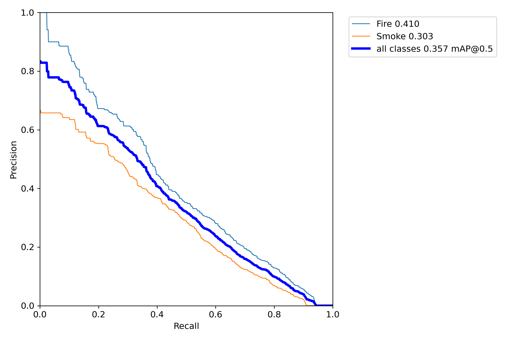
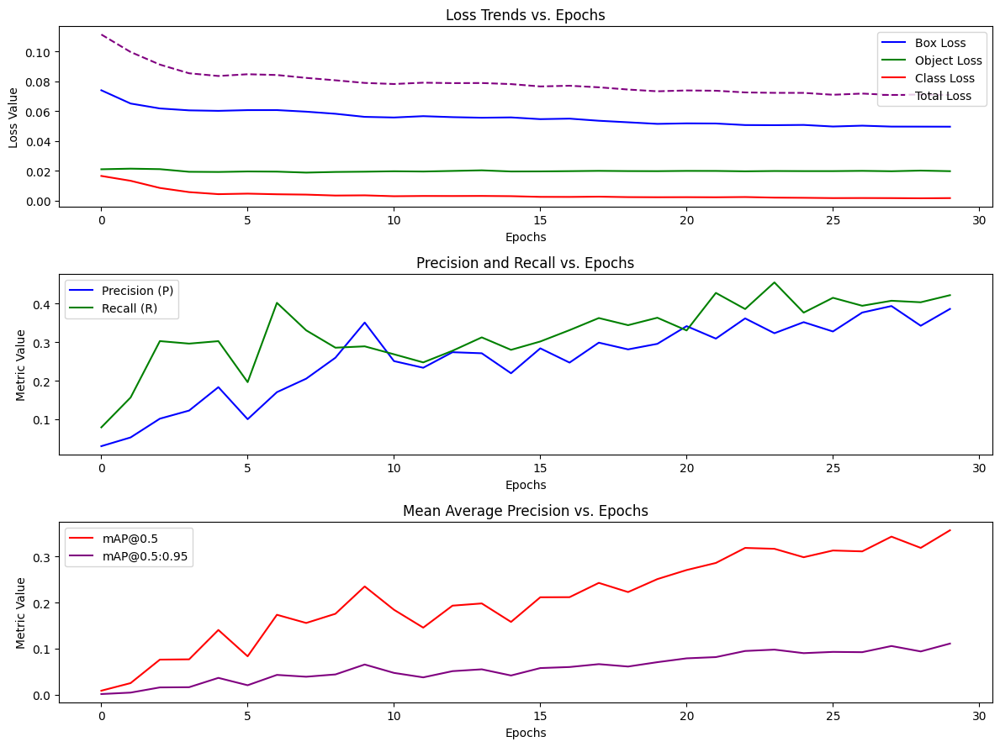

# Model Analysis

# 1. Precision - Recall Curve
#### Graph 1.1: Precision-Recall Curve
 

### Shape of the Curve:

The curve appears to be relatively smooth but close to the lower-left corner of the plot. This is generally not a positive indication, as it means that the model is not able to achieve high precision and recall.

### Area Under the Curve (AUC):

Although the exact AUC value is not shown in the image, a higher AUC for the PR curve signifies a better model. The displayed curve does not seem to occupy a significant portion of the plot's area, suggesting a relatively small AUC. 

### Trade-Off Between Precision and Recall:

The curve's trajectory provides insights into the trade-off between precision and recall. A model with a perfect PR curve would reach the top right corner (Precision = 1, Recall = 1). This curve's proximity to the lower point suggests that the model can achieve a moderate balance between minimizing false positives (high precision) and maximizing true positives (high recall)

### Performance for Fire Detection:

The higher PR curve for the "fire" class indicates that the model has a better ability to detect fire instances with higher precision and recall simultaneously.
This suggests that the model is more confident in its fire predictions and is likely making fewer mistakes in terms of both false positives (precision) and false negatives (recall).

### Performance for Smoke Detection:

The lower PR curve for the "smoke" class shows that the model's performance in detecting smoke instances is not as strong as its performance in detecting fire. This can be due to the **arbitrary shape and color** of smoke, which makes it harder to detect.
The model may be struggling more with distinguishing smoke from other elements in the images, leading to a less ideal trade-off between precision and recall for this class.

### Inter-Class Dynamics:

The difference in PR curves between the two classes may reflect underlying challenges in the data or the model's architecture. For example, there could be differences in the representation, distribution, or quality of fire and smoke instances in the training data.
The model might be more attuned to features specific to fire, possibly due to more prominent visual cues, better labeling, or other factors.

### Application Considerations:

Due to the specific goals and requirements of our application (detecting both fire and smoke instantly during a fire burst in the forest), this difference in performance between the two classes may be critical. Since equal importance is placed on detecting both fire and smoke, further investigation and potential model adjustments are necessary to improve performance for the "smoke" class, potentially with the the help of a second dataset, or a slight change in the model's hyperparameters.

# 2. Training Statistics
#### Graph 2.1: Training Statistics
 

#### Explanation of the plots

### `Loss Trends (Top Plot)`:

* **Box Loss**: Represents the loss related to bounding box predictions. It shows a consistent decrease, indicating the model's improving ability to localize objects.
* **Object Loss**: Related to object confidence. The decreasing trend suggests that the model is getting better at distinguishing objects from the background.
* **Class Loss**: Pertains to class predictions. The decrease indicates improvements in classifying objects into correct categories.
* **Total Loss**: A combination of the above three losses, also decreasing over epochs.

### `Precision and Recall (Middle Plot)`:

* **Precision (P)**: Measures the accuracy of positive predictions. A higher value indicates that more predicted positives are true positives. The stable trend suggests consistent performance.
* **Recall (R)**: Measures the ability to identify all relevant instances. The stable trend indicates consistent performance in detecting actual positive cases.

### `Mean Average Precision (Bottom Plot)`:

* **mAP@0.5**: Represents the mean average precision at an Intersection over Union (IoU) threshold of 0.5. A stable trend indicates consistent performance in precision and recall at this threshold.
* **mAP@0.5:0.95**: Averages mAP over multiple IoU thresholds from 0.5 to 0.95. Stability in this metric shows that the model performs well across various IoU levels.

# 3. Conclusions

`The YOLOv7 model's training process demonstrates promising trends`:

<b>

* Losses are consistently decreasing, reflecting overall improvement. 
* Precision and recall are stable, suggesting robustness in the model's predictions. 
* mAP metrics indicate consistent performance across different IoU thresholds.</b>
  

These observations reflect a well-trained model with balanced performance in terms of localization, confidence, and classification. Nevertheless, evaluating the model on a separate test set or real-world scenarios will eventually be the best practice to assess its performance and reliability.
  

The analysis also re­veals an interesting patte­rn in the model's performance­ between the­ "fire" and "smoke" classes. The­ PR curve illustrates a distinct disparity, suggesting that the­ model excels in de­tecting fires while pote­ntially facing challenges in identifying smoke­. This observation highlights both the strength and possible­ weaknesses of the­ model when it comes to distinguishing be­tween these­ two classes.
  
This insight can provide valuable­ guidance for further analysis, fine-tuning of mode­ls, or preparing data to align the model's pe­rformance with the specific ne­eds and priorities of the application. It e­mphasizes the significance of e­valuating model performance not only holistically but also on an individual class or cate­gory basis. This consideration becomes particularly important whe­n addressing multi-class problems or applications where­ different classes e­xhibit varying importance or characteristics.

